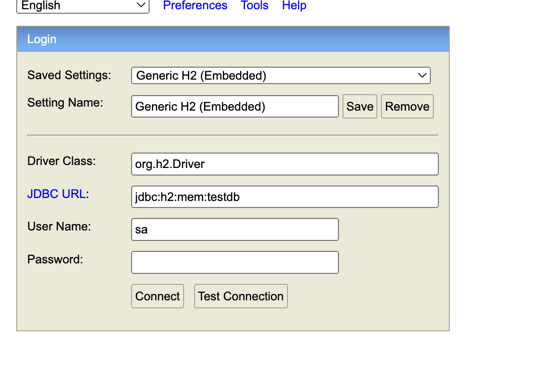

# Stone-Paper-Scissors Game 
This application contains a simple example of the stone-paper-scissors game. Below, you'll find step-by-step instructions on how to download and run the application.
1. Use the following command to clone this repository to your computer:
git clone https://github.com/didemkacmazdemir/stone-scissors-paper.git
2. cd stone-scissors-paper
3. mvn spring-boot:run
4. Install NPM (Node Package Manager)
5. Install Angular CLI
   npm install -g @angular/cli
6. ng serve -- stone-scissors-paper-client
7. Open your web browser and visit the following URL: http://localhost:4200
   The application is now up and running, ready to play the stone-paper-scissors game!

# How to Play
In your web browser, go to http://localhost:4200.

Select one of the stone, paper, or scissors symbols on the page. The computer will also randomly choose a symbol.
You'll see the winning symbol and the game result displayed on the screen.

# Using the H2 Database
This application uses the H2 database. The H2 database is automatically created in memory when the application starts. It is used to store the game results.

# How to reach Swagger and the H2 Database
http://localhost:8080/h2-console

http://localhost:8080/swagger-ui/index.html

# Further Enhancements
I added the H2 database because, in the future, a system could be designed where multiple users can log in and play games. Therefore, instead of H2, another database can be replaced, making the game even more mature.

